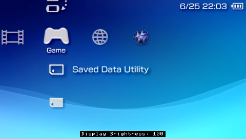
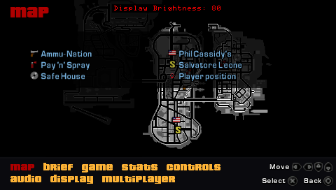
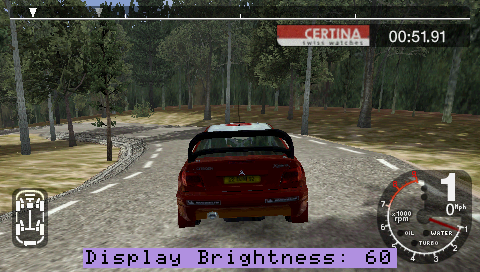
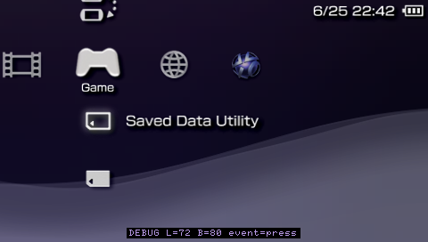

# BetterBright

Brightness control plugin for the PSP, for ARK-4 / FasterARK custom firmware.

Based on the older *bright3* brightness plugin by hiroi01 (itself a mod
of *bright* by plum) - https://hiroi01.com/?p=prx#bright3 - which is where the
original idea came from.

---

## What it does

* Fully customisable brightness levels (default list: `0, 10, 20, 30, 40, 50, 60, 70, 80, 90, 100`)
* Remembers brightness state when launching games / rebooting / waking / exiting to XMB
* Configurable key combo to set brightness level up or down without cycling (the **Display** button still cycles as normal)
* Option to display the current brightness level (OSD)
    * Customise the OSD position, size, background and text colours
* Option to choose a custom "dim" level
* Option to disable display dimming / backlight auto-off ("Power Save")
* Option to disable console sleep ("Power Save") (use with caution)
* Developed and tested on **6.61** / FasterARK and ARK-4, should work fine with 6.60 - older firmwares untested

<table>
  <tr>
    <td></td>
    <td></td>
  </tr>
  <tr>
    <td></td>
    <td></td>
  </tr>
</table>

## How to use

Press the PSP's **Display (brightness) button** to cycle through the brightness
values you list in `BetterBright.ini`.

With the included `.ini` (`combo_mode=1`) you can also hold a trigger + tap the
Display button: **R = brighter, L = dimmer**. See `combo_mode` below for the
other schemes.

It remembers the level you chose and re-applies it after returning to the XMB,
launching a game, rebooting, or waking from sleep - instead of snapping back to
the firmware default.

## Install (ARK-4 / FasterARK)

Put `BetterBright.prx` and `BetterBright.ini` together in your plugins folder and
enable BetterBright in the ARK Custom Launcher.

https://github.com/PSP-Archive/ARK-4/wiki/Plugins

(The included `vsh.txt` / `game.txt` / `pops.txt` in the `legacy` folder are only
for loaders that still use seplugins-style text files. Do yourself a favour and
just use ARK-4 or FasterARK.)

## Configuration (`BetterBright.ini`)

- One brightness value per line, `0`-`100`. `0` = backlight off, `100` = full
  (this may vary depending on your PSP model and display).
- Lines starting with `#` are comments.
- Everything below the list is a plugin option:

**`combo_mode`** - one optional adjust scheme (the plain Display button always
cycles regardless):

| value | scheme |
|-------|--------|
| `0`   | off (Display button cycling only) |
| `1`   | hold a trigger + tap Display: **R = brighter, L = dimmer** (this is the default in the included `.ini`) |
| `2`   | hold both triggers + D-pad: **L+R+Up = brighter, L+R+Down = dimmer** |

Both schemes stop at the dimmest/brightest end of your list (no wrap-around).

**`dim_level`** - how dim the screen goes when the PSP idles. `AUTO` (default)
uses the second-lowest value in your list; or set a specific `0`-`100`. Only has
an effect when `keep_display_on=0`.

**`keep_display_on`** - keep the screen always on. `1` = on, `0` = off (default).

> The PSP's idle **dim** can't be cancelled on its own - it isn't visible to the
> brightness API, so it can't be detected and undone. The only way to stop it is
> to hold off the display idle timer, and because the dim and the backlight
> **auto-off** are two stages of that *same* timer, stopping the dim also stops
> the off. So `keep_display_on=1` means the screen stays **fully on** (no dim and
> no auto-off); `0` gives normal dimming + auto-off per your Power Save settings.
> **Does not affect auto-sleep** (see `disable_sleep`).

**`disable_sleep`** - stop the PSP from auto-sleeping on its own. Manual sleep
(the power switch) still works. `1` = on, `0` = off (default). Use with caution -
the console can stay awake indefinitely.

**`osd_enable`** - briefly show **"Display Brightness: NN"** when you change it.
Works in XMB, games and PS1. `1` = on (default), `0` = off (the overlay code
isn't installed at all).

**`osd_bg_colour`** / **`osd_text_colour`** - the plate and text colours of the
OSD. Defaults are `1` (black plate) and `2` (white text). The palette is named
after real PSP console finishes:

| value | colour | value | colour |
|-------|--------|-------|--------|
| `1`   | Piano Black     | `10`  | Lilac Purple    |
| `2`   | Ceramic White   | `11`  | Blossom Pink    |
| `3`   | Champagne Gold  | `12`  | Rose Pink       |
| `4`   | Ice Silver      | `13`  | The Simpsons (Yellow) |
| `5`   | Mint Green      | `14`  | Spirited Green  |
| `6`   | Felicia Blue    | `15`  | Turquoise Green |
| `7`   | Vibrant Blue    | `16`  | Matte Bronze    |
| `8`   | Radiant Red     | `17`  | Deep Red        |
| `9`   | Metallic Blue   | `18`  | Lavender Purple |

> Exact on the XMB; in some games' framebuffers the tints are approximate (black
> and white are always correct), which is why colour is a stretch option.

**`osd_size`** - `1` = normal, `2` = large (2x).
**`osd_position`** - `1` = bottom (default), `2` = top.

**`debug_enable`** - writes a verbose `BetterBright.log` and shows a debug line on
the OSD for every trigger. For troubleshooting. `0` = off (default).

## Files

- `BetterBright.prx` - the plugin
- `BetterBright.ini` - your settings (keep it next to the .prx).
- `BetterBright.dat` - File the plugin generates to remember your level.
                       Delete it to reset to "nothing remembered".

## Build

See `BUILD.md`. You need the ARK-4 source for one header and one stub library;
everything else is the base PSP SDK.

## Use at your own risk!

Whilst the original display is designed to go to its max brightness, the PSP restricts
this to preserve battery life and "potentially" long-term damage.

**100% brightness will drain the battery faster!**

In an age of quality 1800/2500mAh batteries, and nobody using UMD any more, battery drain isn't
so much of a concern as was 10+ years ago.

## Known issues

- **The OSD may not appear in a few titles** (e.g. GTA: Liberty City Stories).
  Brightness control itself still works - it's only the on-screen text that some
  games' rendering hides. Most games show the OSD in-game normally.
- **OSD colour tints are approximate in some games' framebuffers.** They're exact
  on the XMB; black and white are always correct everywhere.
- If something external changes the backlight in a way the plugin doesn't catch,
  just press the Display button (or your combo) to re-apply your level.

## Testing

 - All testing has been done using a PSP-3000 09g running FasterARK.
 - Feedback appreciated for other models and CFW.

## Credits

- **hobbo91** - BetterBright.
- **hiroi01** - bright3 (the plugin this is loosely based on).
- **plum** - the original bright.
