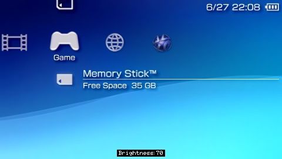
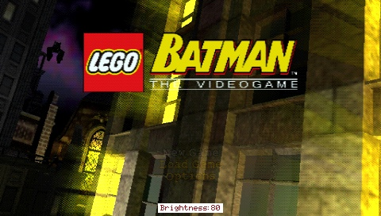
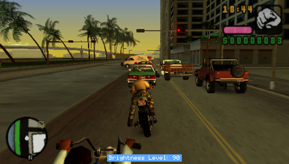
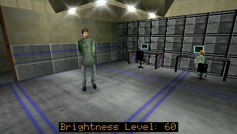
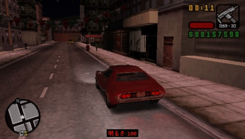
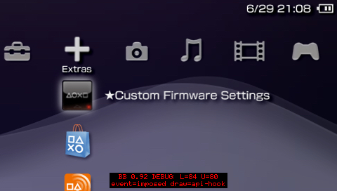

# BetterBright

**Brightness control plugin for the PSP**. Loosely based on the older [bright3](https://hiroi01.com/?p=prx#bright3) by [@hiroi01](https://github.com/hiroi01) (itself a mod of *bright* by plum) — which is where the original idea came from.

[Download BetterBright_v0.92.zip](https://github.com/hobbo91/BetterBright/releases/download/v0.92/BetterBright_v0.92.zip)
---

## What it does

* **Remembers brightness state** when launching games / rebooting / waking / exiting to XMB
* **Fully customisable brightness levels**, with 11 sensible per-model defaults if you don't set your own
* **Configurable key combo** to set brightness level up or down without cycling (the **Display** button still cycles as normal)
* **Option to show the current brightness level** on screen (OSD)
    * Shows in XMB, (most) games, PS1 and homebrew 
    * Customise the OSD position, size (1x-4x), background and text colours
    * The "Brightness Level" label shows in your system language
* Option to **choose a custom "dim" level**
* Option to **disable display dimming / backlight auto-off** ("Power Save")
* Option to **disable auto-sleep** ("Power Save") (use with caution)
* Developed and tested on **6.61** / **FasterARK** and **ARK-4**, **should work fine with 6.60**
* Older firmwares untested. Just upgrade to 6.60/6.61, it's 2026, you'll be fine. 
  
<table>
  <tr>
    <td></td>
    <td></td>
  </tr>
  <tr>
    <td></td>
    <td></td>
  </tr>
  <tr>
    <td></td>
    <td></td>
  </tr>
</table>

## How to use

* Press the PSP's **Display (brightness) button** as normal to cycle through the brightness
values. 

* With the included `.ini` (`combo_mode=1`) you can hold L **or** R Trigger then tap the
Display button: **R = brighter, L = dimmer**.

* You can also use **L + R** then **Up** / **Down** (D-Pad) when you set `combo_mode=2`

* You can change the position, colour, size and language of the OSD by editing `BetterBright.ini`.

It remembers the level you chose and re-applies it after returning to the XMB, launching 
a game, rebooting, or (usually) waking from sleep. 

## Install (ARK-4 / FasterARK)

Put `BetterBright.prx` and `BetterBright.ini` together in your plugins folder and
enable BetterBright in the ARK Custom Launcher.

https://github.com/PSP-Archive/ARK-4/wiki/Plugins

(The included `vsh.txt` / `game.txt` / `pops.txt` in the `legacy` folder are only
for loaders that still use seplugins-style text files. Do yourself a favour and
just use ARK-4 or FasterARK, it's way better.)

## Configuration (`BetterBright.ini`)

Example - leave empty to use the defaults. IPS or after market screens will need to play around with these:
```
# --- BEGIN: List each custom brightness level on each below ---
28
40
50
70
90
99
# ---------------------------------------------------------------
```
- One brightness value per line, `0`-`100`. `0` = backlight off, `100` = full (`99` is the max for PSP-1000/2000 with OEM display,   this may vary further for after market screens)
- Only one whole number per line `0`-`100` are accepted; blank lines, `#` comments and any malformed line are ignored.
- **Leave the list empty** to cycle a built-in default range chosen for your model (PSP-1000, 2000 and 3000/Go,
  each get their own list).
  Set `oem_brightness_levels=1` (below) to instead cycle only the four stock backlight steps.


**`combo_mode`** - Adjust scheme (the plain Display button always cycles regardless):

| value | scheme |
|-------|--------|
| `0`   | off (Display button cycling only) |
| `1`   | hold a trigger + tap Display: **R = brighter, L = dimmer** (this is the default in the included `.ini`) |
| `2`   | hold both triggers + tap D-pad: **Up = brighter, Down = dimmer** (hold to ramp) |

Both schemes stop at the dimmest/brightest end of your list (no wrap-around). In
mode `2`, holding the D-pad auto-repeats/ramps through the levels. 

**`dim_level`** - how dim the screen goes when the PSP idles. `AUTO` (default)
uses the second-lowest value in your list; or set a specific `0`-`100`. Only has
an effect when `keep_display_on=0`.

**`keep_display_on`** - keep the screen always on. `1` = on, `0` = off (default).

**`disable_sleep`** - stop the PSP from auto-sleeping on its own. Manual sleep
(the power switch) still works. `1` = on, `0` = off (default). Use with caution -
the console can stay awake indefinitely.

**`osd_enable`** - briefly show **"Brightness Level: NN"** when you change it, with the
label in your **system language**. Latin languages (English, French, German, Spanish,
Italian, Dutch, Portuguese) use the built-in font; Japanese (明るさレベル), Korean (밝기 레벨),
Chinese (亮度等级) and Russian (Уровень яркости) use small embedded word images, so they
render too. Works in XMB, games and PS1. `1` = on (default), `0` = off (the overlay
code isn't installed at all).

**`osd_bg_colour`** / **`osd_text_colour`** - the plate and text colours of the
OSD. Defaults are `1` (black background) and `2` (white text). Set `osd_bg_colour=0` for no background.

| value | colour | value | colour |
|-------|--------|-------|--------|
| `1`   | Piano Black     | `10`  | Lilac Purple    |
| `2`   | Ceramic White   | `11`  | Blossom Pink    |
| `3`   | Champagne Gold  | `12`  | Rose Pink       |
| `4`   | Ice Silver      | `13`  | The Simpsons (Yellow) |
| `5`   | Mint Green      | `14`  | Spirited Green  |
| `6`   | Felicia Blue    | `15`  | Turquoise Green |
| `7`   | Vibrant Blue    | `16`  | Matte Bronze    |
| `8`   | Radiant Red     | `17`  | Deep Red        |
| `9`   | Metallic Blue   | `18`  | Lavender Purple |
| `0`   | AliExpress Clear Replacement Housing Shell (no background) |

**`osd_size`** - text size: `1` = 1x (normal), `2` = 2x, `3` = 3x, `4` = 4x.

**`osd_position`** - `1` = bottom (default), `2` = top.

**`osd_detect_locale`** - show the OSD "Brightness Level" label in your system language
(`1`, default) or always in English (`0`).

**`osd_draw_mode`** - how the OSD is drawn. `0` = auto (default): draw on the frame
the game presents, and automatically fall back to drawing the live framebuffer for
games that don't drive that path. `1` = API hook only `2` = poll only (always draw the 
live framebuffer). Auto (default) covers virtually every game/app.

**`sync_fw_level`** - keep the firmware's own backlight level (the four stock steps
the Display button normally cycles) in step with your brightness, rounded up to the
nearest step. Your actual brightness is unchanged - it just keeps the firmware's
internal level more consistent with yours. `1` = on (default), `0` = off.

**`oem_brightness_levels`** - only applies when the brightness list above is **empty**
(ignored if you list your own values). `0` (default) cycles the built-in default
range for your model; `1` cycles only the four stock backlight steps - the original
`L=` levels (2000: `36/44/56/68`, 3000/Go: `44/60/72/84`, 1000: `20/40/60/80`).
**Intended for aftermarket LCD panels.**

**`debug_enable`** - diagnostics, for troubleshooting. `0` = off (default). `1` = an
on-screen debug line on every brightness event (press/combo/dim/wake/idle) showing
the firmware level, your level, the event, and how the OSD is being drawn. `2` =
everything in `1` plus a verbose `BetterBright.log` next to the plugin.

## Files

- `BetterBright.prx` - the plugin
- `BetterBright.ini` - your settings (keep it next to the .prx).
- `BetterBright.log` - only when you set `enable_debug=2`
- `BetterBright.dat` - small file the plugin generates to remember the brightness level


## Build

See `BUILD.md`. You need the ARK-4 source for one header and one stub library;
everything else is the base PSP SDK.

## Use at your own risk!

Whilst the original display is designed to go to its max brightness, the PSP restricts
this to preserve battery life and "potentially" long-term damage.

**Max brightness will drain the battery faster!**

In an age of quality 1800/2500mAh batteries, and nobody using UMD any more, battery drain isn't
so much of a concern as was 10+ years ago. But still, it is a thing, especially when overclocked.

## Known issues

- **The OSD reaches the vast majority of games now**, but there are still some
  exceptions, e.g. LEGO Batman (in-game). 
- Setting a backlight higher than the firmware max (e.g. 99) will restore to the
  fw max (e.g. 84) when waking from sleep.
- If something external changes the backlight in a way the plugin doesn't catch,
  just press the Display button (or your combo) to re-apply your level.

## Testing

 - All testing has been done using a PSP-3000 and PSP-2003 with OEM display running FasterARK.
 - Set `debug_mode=2` and attach `BetterBright.log` if you wish top open an issue.
 - Feedback appreciated for other models, displays and CFW.


## Technical notes
 
A few design decisions, in case they're useful to anyone poking at the source:
 
**Brightness is re-applied, not just set once.** The chosen level is written to
`BetterBright.dat` and held by a low-frequency worker thread that re-asserts it
when needed (boot, game launch, return to XMB, resume from sleep). The firmware
sets its *own* brightness during those transitions, so rather than fighting it in
real time the plugin waits a beat and puts your level back. 

Keeping the state on disk - not just in RAM - is what lets it survive
reboots and cold starts.
 
**The OSD draws into the real frame, two ways.** Normally the "Brightness Level: NN"
overlay is written onto the framebuffer the system is *about* to show, via a
hook on `sceDisplaySetFrameBuf` - no GPU race, no flicker. Some games never drive
that hook, so for them the plugin falls back to reading the *currently displayed*
framebuffer (`sceDisplayGetFrameBuf`) and drawing into it from a worker thread,
synced to vblank. The fallback only touches buffers the display is actively
scanning (always-mapped VRAM, plus the live buffer) and the draw thread is fully
stopped before the plugin unloads - so it avoids the fixed-VRAM / background-thread
crash that sank earlier attempts. `osd_draw_mode` selects between them.

**Logging is deferred, not inline.** With `debug_enable=2`, log lines are pushed
into a small in-RAM ring from any context (the brightness hook included) and
flushed to disk by the worker thread - so runtime events are captured without doing
unsafe file I/O inside a hook.
 
**No controller or syscon hooks.** An earlier attempt to lock the buttons during a
manual screen-off seems to cause crashes in some games. 
 
**The idle dim is "invisible".** The PSP's idle dim isn't reported by the
brightness API, so it can't be read back and undone directly - the only way to
stop it is to hold off the display idle timer (see `keep_display_on`). The dim and
the backlight auto-off are two stages of the *same* timer, so they can't be
separated.
 
**Firmware-specific.** The brightness patch is found by scanning for a specific
instruction pattern, and the dim/restore logic is built around the native
backlight steps this firmware uses. That work was done on **6.61** - it should
carry to other CFW as long as it's not mega old. 

## Credits

- **hobbo91** - BetterBright.
- **hiroi01** - bright3 (the plugin this is loosely based on).
- **plum** - the original bright.
